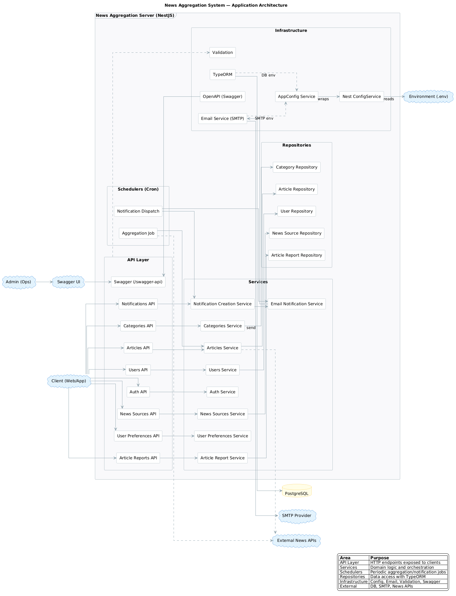
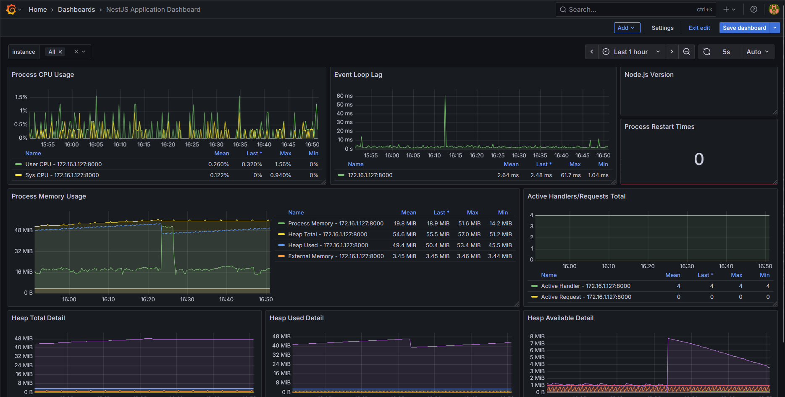

# 📰 News Aggregation System

Powerful, modular, and observable news aggregation backend built with NestJS and TypeScript — fetches from external sources, moderates content, personalizes feeds, and exposes clean APIs and metrics.

[](https://www.typescriptlang.org/)
[](https://nestjs.com/)
[](https://nodejs.org/)
[](https://www.postgresql.org/)
[](https://www.docker.com/)
[](#-api-documentation-swagger)
[](#-monitoring-prometheus--grafana)
[](#-monitoring-prometheus--grafana)

---

## 📌 Table of Contents

- Overview
- Features
- Architecture & Stack
- Screenshots
- Quick Start
- API Documentation (Swagger)
- Monitoring (Prometheus & Grafana)
- Project Structure
- Documentation
- Contributing & License

---

## 🧭 Overview

The backend ingests articles from external APIs, stores and categorizes them, applies moderation policies, personalizes results for users, and sends notification emails. It ships with API docs (Swagger) and metrics (/metrics) for Prometheus.

Key capabilities:

- Fetch from external sources (e.g., NewsAPI, The News API)
- Store and categorize in PostgreSQL
- REST APIs for clients
- Email notifications based on preferences
- Content moderation (reports, banned keywords)
- Personalization signals (reading history, likes, bookmarks)

---

## ✨ Features

### Admin & Moderation

- Report System: users can flag inappropriate content
- Auto-Moderation: auto-hide when reports exceed thresholds
- Category Management: activate/deactivate categories
- Banned Keywords: filtered during processing

### Personalization

- Recommendations foundation: based on behavior signals
- Behavior Tracking: reading history, likes, bookmarks
- Personalized Feeds: by preferences and categories
- Engagement Analytics: insights for admins

---

## 🏗️ Architecture & Stack

- Framework: NestJS (modular DI)
- Language: TypeScript
- Database: PostgreSQL (TypeORM)
- Auth: JWT (Swagger Bearer scheme)
- Email: SMTP provider config via env
- Observability: Prometheus metrics + Grafana dashboards

Key entry points:

- Bootstrap: `src/main.ts`
- Wiring: `src/app.module.ts`
- Config: `src/config/app-config/*`, env via `.env`
- Metrics endpoint: `src/metrics/*` → `GET /metrics`
- Docker services: `docker-compose.yml`
- Prometheus config: `prometheus.yml`

---

## 📸 Screenshots

- Architecture Overview

  

- Grafana Dashboards

  

---

## ⚡ Quick Start

Prerequisites

- Node.js 18+
- PostgreSQL
- Docker (optional, for Prometheus/Grafana)

Install dependencies

```sh
npm install
```

Configure environment

- Copy `.env.example` → `.env` and set values (DB, SERVER_HOST, SERVER_PORT, JWT, mail)

Run the server

```sh
npm run start:dev
```

Seed data (optional)

```sh
npm run seed
```

---

## 📜 API Documentation (Swagger)

- Path: `/{SWAGGER_URL}` (default `/swagger-api`)
- The server port is read from env (`SERVER_PORT`).
- Defined in `src/main.ts` using `APP.SWAGGER_URL` from `src/common/constants/app.constants.ts`.

Example (if `SERVER_PORT=8000`):

- Swagger: http://localhost:8000/swagger-api

---

## 📈 Monitoring (Prometheus & Grafana)

Metrics endpoint

- `GET /metrics` (default process/node metrics)

Prometheus config

- File: `prometheus.yml` (used as an in-container template)
- The target is rendered at container start from env vars — no manual edits needed.

Prometheus target via env (SERVER_HOST / SERVER_PORT)

- The compose entrypoint replaces `__APP_TARGET__` with `${SERVER_HOST}:${SERVER_PORT}` and prints what it resolved.
- Defaults (if not set): `SERVER_HOST=host.docker.internal`, `SERVER_PORT=8000`.
- Override in your `.env` at project root:

```env
# Server the app listens on
SERVER_HOST=192.168.0.1   # or host.docker.internal on Docker Desktop
SERVER_PORT=8000          # must match your Nest app port
```

Start monitoring stack (from project root)

```sh
docker compose up -d
```

URLs

- Prometheus: http://localhost:9090
- Grafana: http://localhost:3000

Tips

- Windows/macOS (Docker Desktop): `host.docker.internal` usually works out of the box.
- Linux: modern Docker supports `host.docker.internal`; if not, use your host IP (e.g., `192.168.x.x`) or the docker bridge (often `172.17.0.1`).
- You can confirm the resolved target in Prometheus logs; the container prints:
  - `SERVER_HOST=… SERVER_PORT=…` and `Resolved TARGET=…`

---

## 🗂️ Project Structure

```
src/
	auth/                  # JWT auth, guards, strategies
	articles/              # Articles APIs & services
	categories/            # Category CRUD
	cron/                  # Aggregation workflow
	database/              # Entities, repositories, seeds
	email/                 # Email infrastructure
	keywords/              # Keywords & filters
	metrics/               # Prometheus metrics endpoint
	news-sources/          # External sources (admin)
	notifications/         # Notifications + email
	user-preferences/      # Subscriptions/preferences
	user-reading-history/  # Reading history tracking
	users/                 # Users APIs & services
```

---

## 📚 Documentation

- [Product Requirements Document](docs/product-requirements-document.md)
- [FAQ](docs/frequently-asked-questions.md)

---

## 📄 License

This project is currently UNLICENSED.
