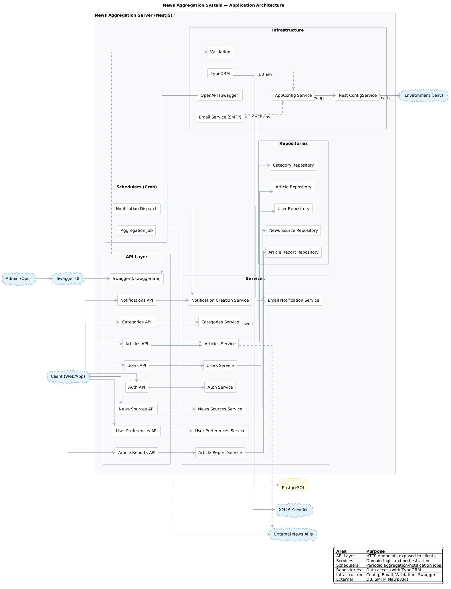

# 📰 News Aggregation System

Powerful, modular, and observable news aggregation backend built with NestJS and TypeScript — fetches from external sources, moderates content, collects personalization signals, and exposes clean APIs and metrics.

[](https://www.typescriptlang.org/)
[](https://nestjs.com/)
[](https://nodejs.org/)
[](https://www.postgresql.org/)
[](https://www.docker.com/)
[](#-api-documentation-swagger)

---

## 📌 Table of Contents

- [Overview](#-overview)
- [Features](#-features)
- [Architecture & Stack](#️-architecture--stack)
- [Screenshots](#-screenshots)
- [Quick Start](#-quick-start)
- [Docker Setup](#-docker-setup)
- [Environment Variables](#-environment-variables)
- [API Documentation (Swagger)](#-api-documentation-swagger)
- [Key Endpoints](#-key-endpoints)
- [External API Sources](#-external-api-sources)
- [User Roles](#-user-roles)
- [Project Structure](#-project-structure)
- [Documentation](#-documentation)
- [License](#-license)

---

## 🧭 Overview

The **News Aggregation System** is a production-ready REST API backend that ingests news articles from external APIs on a schedule, stores and categorizes them in PostgreSQL, applies content moderation, records personalization-related signals per user, and delivers email notifications. It ships with interactive API docs (Swagger), a Prometheus-compatible metrics endpoint, and a Docker Compose setup for one-command local deployment.

Key capabilities:

- **Automated ingestion** — fetches from external sources (NewsAPI, The News API) every 3–4 hours via cron jobs
- **Storage & categorization** — persists articles in PostgreSQL with deduplication and auto-categorization
- **REST APIs** — clean, versioned endpoints for both user-facing and admin operations
- **Email notifications** — SMTP-based alerts based on category or keyword preferences
- **Content moderation** — user-driven reports, auto-hide threshold, and banned-keyword filtering
- **Personalization signals** — reading history, likes/dislikes, and bookmarks power future recommendations
- **Observability** — Swagger UI at `/swagger-api`, health check at `/health`, Prometheus metrics at `/metrics`

---

## ✨ Features

### News Ingestion & Processing

- Periodic fetch from multiple external news APIs (cron-based, every 3–4 hours)
- Article deduplication — no duplicate entries across API calls
- Auto-categorization of uncategorized articles by mapping external API categories to internal categories, falling back to "General" when unmapped
- News source management — admins can add, edit, and monitor external API sources
- Source status tracking — marked Active/Inactive based on API response health

### User Management & Authentication

- User registration with email validation (default role: **User**)
- JWT-based stateless authentication (Bearer token)
- Role-based access control (**Admin** / **User**)
- Bcrypt password hashing (configurable salt rounds)

### Content Discovery

- Browse headlines by date or date range
- Filter by category (All, Business, Entertainment, Sports, Tech, etc.)
- Text search within stored articles
- Sort results by likes or dislikes

### Personalization & Engagement

- **Reading history** — tracks which articles a user has read
- **Likes / Dislikes** — per-user reactions on articles
- **Bookmarks** — save articles for later reference
- **Personalization signals** — stored preference and behavior data that can be used by downstream services to build personalized feeds
- **Engagement data collection** — records user interactions (reads, reactions, bookmarks) for potential analytics or reporting

### Notifications

- **Category subscriptions** — receive all news for selected categories via email
- **Keyword subscriptions** — receive news matching specific keywords within a category (hierarchical: keyword scope is limited to its parent category)
- Batched email delivery (multiple matching articles in one email)
- Notification history viewable in-app; read notifications are marked automatically

### Admin & Moderation

- **Report system** — users can flag inappropriate articles
- **Auto-moderation** — articles are auto-hidden when report count exceeds configured threshold
- **Category management** — activate or deactivate categories
- **Banned keywords** — globally filtered during article processing
- **News source management** — configure external API endpoints and API keys

---

## 🏗️ Architecture & Stack

| Layer | Technology |
|---|---|
| Framework | NestJS 11 (modular, dependency-injection) |
| Language | TypeScript 5.7 |
| Runtime | Node.js 20+ |
| Database | PostgreSQL 15+ via TypeORM 0.3 |
| Authentication | JWT (`@nestjs/jwt` + Passport) |
| Password Hashing | bcryptjs (12 salt rounds) |
| Email | Nodemailer (SMTP — supports Gmail & custom) |
| HTTP Client | axios (external API calls) |
| Scheduling | `@nestjs/schedule` (cron jobs) |
| API Docs | `@nestjs/swagger` (OpenAPI 3) |
| Containerization | Docker (multi-stage, Alpine) + Docker Compose |
| Deployment | Heroku (Procfile + `heroku.yml`) |
| Build | SWC (fast TypeScript compilation) |
| Linting / Formatting | ESLint 9 + Prettier 3 + Husky pre-commit hooks |
| Testing | Jest 29 + ts-jest + Supertest |

Key source entry points:

- **Bootstrap** — `src/main.ts`
- **Module wiring** — `src/app.module.ts`
- **Configuration** — `src/config/app-config/`, resolved from `.env`

---

## 📸 Screenshots

### Architecture Overview



---

## ⚡ Quick Start

**Prerequisites**

- Node.js 20+
- PostgreSQL 15+

```sh
# 1. Install dependencies
npm install

# 2. Configure environment
cp .env.example .env
# Edit .env with your database credentials, JWT secret, and mail settings

# 3. Run in development (watch mode)
npm run start:dev

# 4. (Optional) Seed initial data
npm run seed
```

Access the running server:

| Service | URL |
|---|---|
| API base | `http://localhost:3000` |
| Swagger UI | `http://localhost:3000/swagger-api` |
| Health check | `http://localhost:3000/health` |
| Prometheus metrics | `http://localhost:3000/metrics` |

---

## 🐳 Docker Setup

Run the full stack (app + PostgreSQL) with a single command:

```sh
# Start all services (requires a configured .env file)
docker-compose up

# Start in detached mode
docker-compose up -d

# Stop services
docker-compose down
```

The Docker image uses a multi-stage Alpine build optimized for production. The compose file includes a startup delay so the app waits for PostgreSQL to be ready.

---

## 🔧 Environment Variables

Copy `.env.example` to `.env` and configure the following variables:

```env
# ── Server ───────────────────────────────────────────────
PORT=3000                 # Port the server listens on (Heroku uses PORT automatically)
NODE_ENV=development      # development | production

# ── Database (PostgreSQL) ────────────────────────────────
DATABASE_HOST=localhost
DATABASE_PORT=5432
DATABASE_USERNAME=postgres
DATABASE_PASSWORD=your_password
DATABASE_NAME=news_app

# ── Authentication (JWT) ─────────────────────────────────
JWT_SECRET=your-super-secret-jwt-key-here-make-it-long-and-random
JWT_EXPIRES_IN=7d

# ── Email (SMTP / Gmail) ─────────────────────────────────
# For Gmail: enable 2FA and generate an App Password
MAIL_HOST=smtp.gmail.com
MAIL_PORT=587
MAIL_SECURE=false         # false for port 587, true for port 465
MAIL_USER=your-email@gmail.com
MAIL_PASS=your-app-password-here
MAIL_FROM_NAME="News Aggregator"
MAIL_FROM_ADDRESS=your-email@gmail.com
```

> **Gmail note:** Use an [App Password](https://myaccount.google.com/apppasswords), not your regular Gmail password. 2-factor authentication must be enabled on the Google account first.

---

## 📜 API Documentation (Swagger)

Interactive OpenAPI documentation is available at `/swagger-api` (default) when the server is running. The path is configured via `APP.SWAGGER_URL` in `src/common/constants/app.constants.ts`.

Example (port 3000): `http://localhost:3000/swagger-api`

All endpoints require a **Bearer token** (JWT) in the `Authorization` header unless otherwise noted. Obtain a token via the `/auth/login` endpoint.

---

## 🔌 Key Endpoints

| Endpoint | Description |
|---|---|
| `POST /auth/register` | Register a new user |
| `POST /auth/login` | Authenticate and receive a JWT |
| `GET /articles` | List articles (filter by category, date, search) |
| `GET /articles/:id` | Get a single article |
| `PUT /user-reactions/:articleId` | Like or dislike an article |
| `POST /user-bookmarks/:articleId` | Bookmark an article |
| `GET /user-bookmarks` | List bookmarked articles |
| `GET /reading-history` | View reading history |
| `GET /user-preferences` | Get notification preferences |
| `PUT /user-preferences/:categoryId` | Update notification preferences |
| `GET /categories` | List available categories |
| `GET /news-sources` | List external news sources (admin) |
| `GET /health` | Health check |
| `GET /metrics` | Prometheus metrics |
| `GET /swagger-api` | Swagger UI |

---

## 🌐 External API Sources

The system fetches news from the following external APIs (configurable via the admin panel):

| API | Documentation |
|---|---|
| **NewsAPI** | [newsapi.org](https://newsapi.org/) |
| **The News API** | [thenewsapi.com](https://www.thenewsapi.com/documentation) |

API keys are stored in the `news_sources` database table and managed by admins. Each source has an admin-controlled `isActive` flag, and fetch jobs update metadata such as `lastFetchAt` and `lastError`. Source “health” or status in the UI/APIs is derived from `isActive` together with `lastError` (e.g., recent failures or quota issues), but failures do not automatically toggle `isActive` off.

---

## 👤 User Roles

| Role | Capabilities |
|---|---|
| **User** | Register, login, browse articles, search, like/dislike, bookmark, manage reading history, configure notification preferences |
| **Admin** | All user capabilities + manage categories, banned keywords, news sources, view reports, configure moderation thresholds |

---

## 🗂️ Project Structure

```
src/
├── main.ts                      # Bootstrap entry point
├── app.module.ts                # Root module wiring
│
├── auth/                        # JWT auth, guards, Passport strategies
├── users/                       # User CRUD, registration, profiles
├── categories/                  # Category management (activate/deactivate)
│
├── articles/                    # Article APIs & services
├── article-reports/             # Report system for inappropriate content
├── banned-keywords/             # Banned keyword filtering
│
├── user-reactions/              # Like / dislike functionality
├── user-bookmarks/              # Save articles for later
├── user-reading-history/        # Read-history tracking
├── user-preferences/            # Notification subscriptions (category & keyword)
│
├── keywords/                    # Keyword management
├── news-sources/                # External API source management (admin)
├── news-aggregation/            # Aggregation orchestration service
├── cron/                        # Scheduled tasks (periodic news fetch)
│
├── notifications/               # Notification dispatch
├── email/                       # SMTP email infrastructure (Nodemailer)
│
├── database/                    # TypeORM entities, repositories, migrations, seeds
├── config/                      # Environment-based app configuration
└── common/                      # Shared utilities, guards, constants, health checks
```

### npm Scripts

| Command | Description |
|---|---|
| `npm run start:dev` | Run with live-reload (development) |
| `npm run start:debug` | Run with Node.js debugger attached |
| `npm run build` | Compile TypeScript → `dist/` |
| `npm run start:prod` | Run compiled production build |
| `npm run seed` | Seed initial database data |
| `npm run lint` | ESLint with auto-fix |
| `npm run format` | Prettier formatting |
| `npm run test` | Run Jest unit tests |
| `npm run test:cov` | Run tests with coverage report |
| `npm run test:e2e` | Run end-to-end tests |

---

## Deploy on Heroku

[](https://dashboard.heroku.com/new?template=https://github.com/ayush-pr0/news-app/tree/master)

Heroku deployment uses `Procfile` (`npm run start:prod`) and reads the `PORT` environment variable automatically.

---

## 📚 Documentation

- [Product Requirements Document](docs/product-requirements-document.md)
- [FAQ](docs/frequently-asked-questions.md)
- [News Aggregation High-Level Docs](docs/news-aggregation-high-level-docs.md)
- [Architecture Diagram (PlantUML source)](docs/architecture.puml)

---

## 📄 License

This project is currently UNLICENSED.
